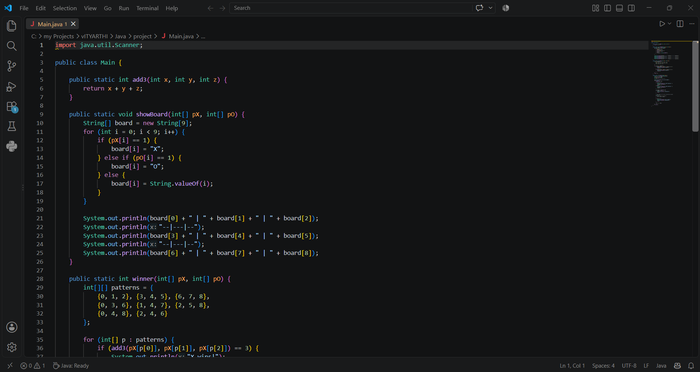
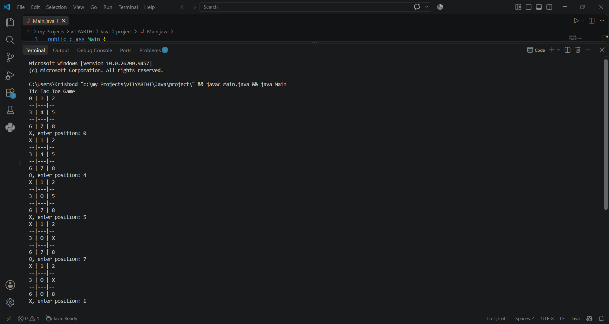
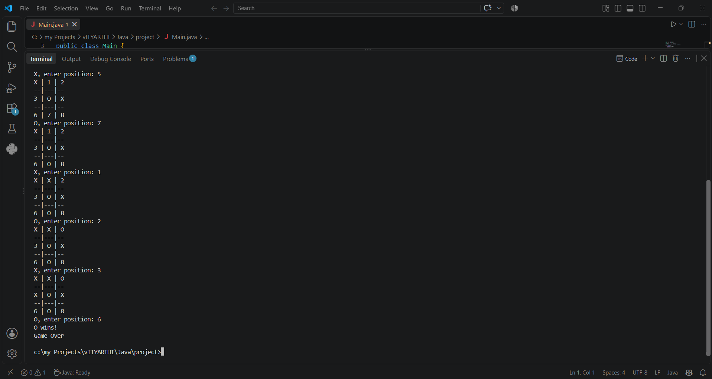

# Tic-Tac-Toe Game (Java)

**Author:** Krishna Paliwal  
**Registration Number:** 25BAI11317  

---

## Overview
This project is a text-based, two-player Tic‑Tac‑Toe game developed in Java. It runs in the terminal and allows two players (Player X and Player O) to play alternately by selecting grid positions from 0 to 8. The application illustrates core programming and software design concepts—including modular methods, 1D array manipulation, game loop management, input validation, and win/draw condition evaluations.

---

## Features
- **Turn-Based Gameplay:** Seamless automatic turn alternation between Player X and Player O.
- **Dynamic Board Display:** Real-time visual 3×3 grid rendering in the console after every move.
- **Input Validation:** Automatically prevents invalid inputs (numbers outside 0–8, non-numeric input) and prevents overwriting already occupied cells.
- **Win Detection:** Automatically scans all 8 winning combinations (3 rows, 3 columns, 2 diagonals) after each move.
- **Draw Handling:** Detects when all 9 grid cells are occupied without a winner and terminates gracefully.

---

## Technologies / Tools Used
- **Language:** Java (JDK 8+)
- **Concepts:** Loops (`while`), Conditionals (`if-else`), Arrays (`1D int[]` & `String[]`), Static Methods, Scanner I/O
- **Version Control:** Git & GitHub
- **IDE / Environment:** Visual Studio Code / Terminal

---

## Steps to Install & Run the Project

1. **Prerequisites:** Ensure Java Development Kit (JDK) is installed:
   ```bash
   javac -version
   java -version
   ```
2. **Clone the Repository:**
   ```bash
   git clone https://github.com/Sayan-stg/tic-tac-toe-java-project.git
   cd tic-tac-toe-java-project
   ```
3. **Compile the Application:**
   ```bash
   javac project/Main.java
   ```
4. **Run the Game:**
   ```bash
   java -cp project Main
   ```

---

## Instructions for Testing

### 1. Automated Logic Validation Tests
Run the standalone test suite verifying win patterns and draw conditions:
```bash
javac project/Main.java project/TestGame.java
java -cp project TestGame
```
**Expected Output:**
- `[PASS] Test Row Win (Top row 0-1-2)`
- `[PASS] Test Column Win (Left column 0-3-6)`
- `[PASS] Test Diagonal Win (Main diagonal 0-4-8)`
- `[PASS] Test Draw Condition (Full board, no winner)`
- `[PASS] Test Incomplete Game (Returns -1)`

### 2. Manual Test Cases
- **Test Case 1 (Row Win):** Input sequence `0`, `3`, `1`, `4`, `2` -> Player X wins on row `[0, 1, 2]`.
- **Test Case 2 (Draw Game):** Input sequence `0`, `1`, `2`, `4`, `3`, `5`, `7`, `6`, `8` -> All 9 positions filled with no line of 3 -> prints `It's a draw!`.
- **Test Case 3 (Invalid Input & Overwrite Rejection):**
  - Enter `10` -> Displays `Invalid position! Please choose between 0 and 8.` and prompts again.
  - Enter an already chosen position (e.g., `0` again) -> Displays `Position already occupied! Choose an empty spot.` and prompts again.

---

## Screenshots

### 1. Code Implementation (VS Code)


### 2. Game Input & Execution


### 3. Match Outcome & Win Declaration


---

## File Structure

```
.
├── project/
│   ├── Main.java         # Main game execution and logic
│   ├── TestGame.java     # Automated unit & validation test suite
│   └── main.py           # Original reference implementation
├── screenshot/
│   ├── input1.png        # Source code part 1
│   ├── input2.png        # Source code part 2
│   ├── input3.png        # Source code part 3
│   ├── output1.png       # Gameplay terminal execution
│   └── output2.png       # Terminal match result
├── Statement.md          # Project problem statement, scope, target users, features
├── TicTacToe_ProjectReport.pdf # 15-page comprehensive project report
└── README.md             # Project documentation and instructions
```
